# Sistema de Gerenciamento de Hospedagens Hoteleiras 🏨

Este projeto foi desenvolvido como parte da matéria de Banco de Dados II durante a minha graduação em Engenharia de Software. Com foco em práticas de modelagem e manipulação de dados utilizando o MySQL, o objetivo do sistema é centralizar e otimizar o gerenciamento de informações de hotéis, quartos, clientes e hospedagens.

## 📑 Índice

- [Objetivo do Projeto](#objetivo-do-projeto)
- [Estrutura do Banco de Dados](#estrutura-do-banco-de-dados)
- [Funcionalidades Implementadas](#funcionalidades-implementadas)
- [Consultas SQL](#consultas-sql)
- [Procedimentos e Funções com PLMySQL](#procedimentos-e-funções-com-plmysql)
- [Triggers](#triggers)
- [Telas de Saídas](#telas-de-saídas)
- [Tecnologias Utilizadas](#tecnologias-utilizadas)
- [Resultados e Conclusão](#resultados-e-conclusão)
- [Nota Final](#nota-final)
- [Autora](#autora)

##  🎯 Objetivo do Projeto

O sistema visa centralizar e simplificar o gerenciamento de reservas, dados de clientes, quartos e histórico de hospedagem, aplicando conceitos fundamentais de banco de dados, como:
- **Estruturação de tabelas e relacionamentos**: tabelas para armazenar informações de clientes, reservas e quartos, com implementação de relacionamentos específicos.
- **Consultas SQL**: desenvolvimento de queries para gerar relatórios e extrair informações relevantes.

##  🏛️ Estrutura do Banco de Dados

O sistema foi projetado para armazenar informações detalhadas das entidades a seguir:

- **Tabela “Hotel”**: Armazena informações dos hotéis, como ID, nome, cidade, estado (UF) e classificação em estrelas.
- **Tabela “Quarto”**: Armazena dados dos quartos, incluindo ID, ID do hotel ao qual pertence, número, tipo e preço da diária.
- **Tabela “Cliente”**: Contém dados dos clientes, como ID, nome, email, telefone e CPF.
- **Tabela “Hospedagem”**: Guarda os registros de hospedagens, incluindo ID, ID do cliente, ID do quarto, datas de check-in e check-out, valor total e status da hospedagem (reserva, hospedado, finalizada, cancelada).

##  ⚙️ Funcionalidades Implementadas

1. **Cadastro de Clientes**: Inserção e atualização de dados dos clientes.
2. **Gerenciamento de Quartos**: Controle de tipos, disponibilidade e preços dos quartos.
3. **Reserva e Check-in/Check-out**: Registro de reservas e monitoramento do status da hospedagem.
4. **Consultas e Relatórios**: Consultas SQL para fornecer insights, como reservas ativas e histórico de hóspedes.

##  🔍 Consultas SQL

As consultas incluem:
- **Listar hotéis e seus quartos**: Exibir informações do hotel e dados dos quartos.
- **Clientes com hospedagens finalizadas**: Mostrar clientes e histórico de quartos e hotéis com status finalizado.
- **Histórico de hospedagens por cliente**: Listar hospedagens em ordem cronológica para um cliente específico.
- **Cliente com mais hospedagens**: Identificar o cliente com o maior número de hospedagens.
- **Clientes com hospedagens canceladas**: Listar clientes com reservas canceladas e seus detalhes.
- **Receita total por hotel**: Calcular receita de hospedagens finalizadas por hotel.
- **Clientes com reservas em hotel específico**: Mostrar clientes que já reservaram um hotel em particular.
- **Gasto total por cliente em hospedagens finalizadas**: Exibir clientes e valores totais gastos.
- **Quartos nunca utilizados**: Listar quartos sem registros de hospedagens.
- **Média de preços das diárias por tipo de quarto**: Calcular a média dos preços das diárias por tipo de quarto.

##  🔧 Procedimentos e Funções com PL/MySQL

Foram criados procedimentos e funções para automatizar operações e consultas:

- **Procedures**:
  - `RegistrarCheckIn`: Atualiza a data de check-in e o status para “hospedado”.
  - `CalcularTotalHospedagem`: Calcula o valor total com base nos dias de estadia e preço da diária.
  - `RegistrarCheckout`: Atualiza a data de check-out e define o status como “finalizada”.
  
- **Functions**:
  - `TotalHospedagensHotel`: Retorna o número total de hospedagens em um hotel específico.
  - `ValorMedioDiariasHotel`: Calcula o valor médio das diárias de um hotel.
  - `VerificarDisponibilidadeQuarto`: Verifica a disponibilidade de um quarto para uma data específica.

##  ⚡ Triggers

- **AntesDeInserirHospedagem**: Trigger que verifica a disponibilidade do quarto antes de inserir uma nova hospedagem.
- **AposDeletarCliente**: Trigger que registra a exclusão de um cliente em uma tabela de log.

##   🖥️ Telas de Saídas

Para atender ao escopo do projeto de Banco de Dados II da minha faculdade, foram solicitadas as seguintes telas de saída, que têm como objetivo proporcionar uma interface clara e funcional para a interação com o sistema de gerenciamento de hospedagens hoteleiras. Cada tela foi projetada para atender a uma necessidade específica do sistema, garantindo que os usuários possam realizar operações como cadastro de clientes, gerenciamento de quartos, reserva de hospedagens e geração de relatórios. As telas solicitadas são as seguintes:

1. Criação do Banco de Dados
- **Criação do banco de dados `hospedar_db`.**

  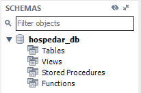

2. Criação de Tabelas
- **Criação das tabelas: `Hotel`, `Quarto`, `Cliente`, `Hospedagem`.**

  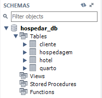

3. Inserção de Dados
- **Inserção de dados fictícios:**
  - **Hotel**: 2 hotéis
  - **Quarto**: 5 quartos para cada hotel
  - **Cliente**: 3 clientes
  - **Hospedagem**: 20 hospedagens (5 para cada status: "finalizada", "hospedado", "reserva", "cancelada")

4. Consultas SQL
- **a**: Listar hotéis e quartos (`nome`, `cidade`, `tipo`, `preco_diaria`).

  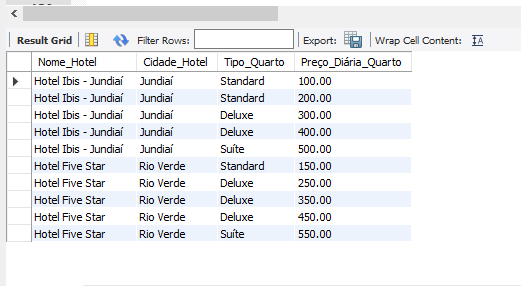

- **b**: Listar clientes com hospedagens "finalizadas" e respectivos quartos e hotéis.

  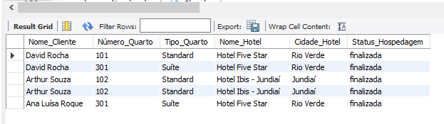

- **c**: Histórico de hospedagens de um cliente.

  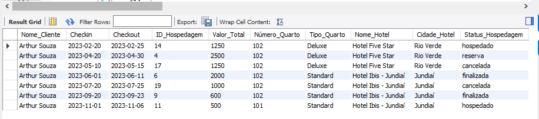

- **d**: Cliente com maior número de hospedagens.

  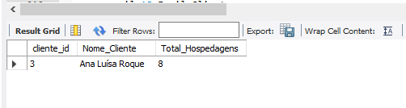

- **e**: Clientes com hospedagem "cancelada", respectivos quartos e hotéis.

  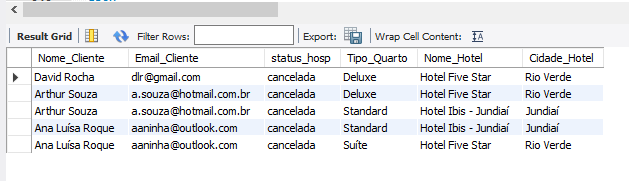

- **f**: Receita dos hotéis (status "finalizada").

  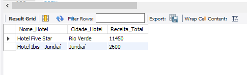

- **g**: Clientes com reserva em hotel específico.

  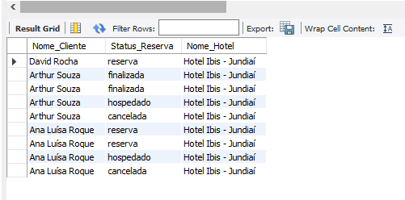

- **h**: Valor gasto por cliente em hospedagens "finalizadas".

  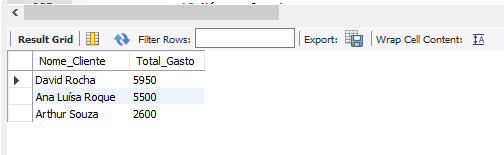

- **i**: Quartos sem hóspedes.

  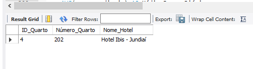

- **j**: Média de preços de diárias por tipo de quarto.

  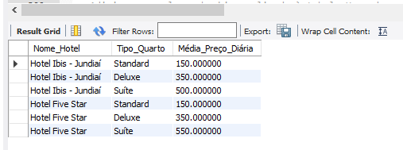

- **l**: Criar coluna `checkin_realizado` em `Hospedagem` (booleano).

  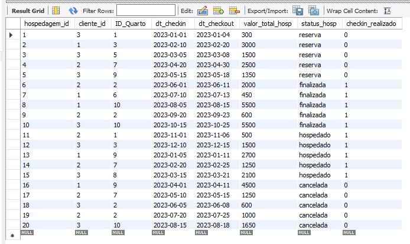

- **m**: Renomear coluna `classificacao` para `ratting` em `Hotel`.

  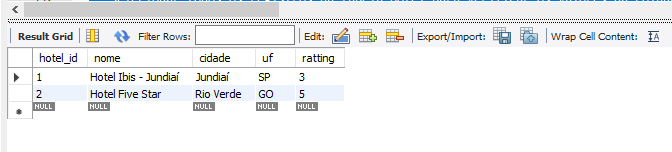

5. Procedimentos PL/MySQL
- **a**: Procedure `RegistrarCheckIn` para atualizar check-in e status.
- **b**: Procedure `CalcularTotalHospedagem` para calcular o valor total.
- **c**: Procedure `RegistrarCheckout` para atualizar check-out e status.

  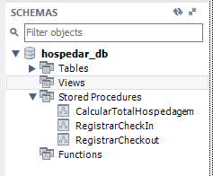

6. Funções PL/MySQL
- **a**: Função `TotalHospedagensHotel` para retornar o total de hospedagens de um hotel.
- **b**: Função `ValorMedioDiariasHotel` para calcular a média das diárias.
- **c**: Função `VerificarDisponibilidadeQuarto` para verificar disponibilidade de quarto.

  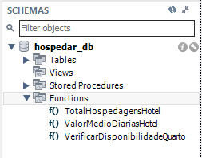

7. Triggers PL/MySQL
- **a**: Trigger `AntesDeInserirHospedagem` para verificar a disponibilidade do quarto antes de inserir.
- **b**: Trigger `AposDeletarCliente` para registrar exclusão de cliente em log.

  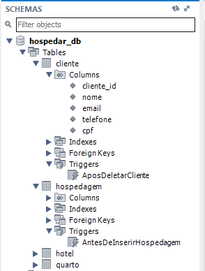

Essas telas são fundamentais para garantir que o sistema atenda às necessidades dos usuários e forneça uma experiência interativa, facilitando a gestão de informações e operações no sistema de gerenciamento de hospedagens hoteleiras.

##  🛠️ Tecnologias Utilizadas

- **MySQL**: Para desenvolvimento do banco de dados relacional e execução de consultas SQL.
- **Workbench/MySQL CLI**: Ferramentas de administração e desenvolvimento SQL.

##  📊 Resultados e Conclusão

Este projeto proporcionou a oportunidade de aplicar conceitos de banco de dados de forma prática e abrangente, reforçando habilidades em modelagem de dados, manipulação de SQL e automação com PL/MySQL. Essas experiências ampliaram minha compreensão sobre o gerenciamento de dados, preparando-me para desafios do mercado de trabalho.

##  🎓 Nota Final

Obtive a nota máxima neste projeto, o que reafirma minha dedicação e interesse na área de banco de dados dentro da Engenharia de Software.

##  👩‍💻 Autora

Este projeto foi desenvolvido por **Bárbara Rocha**, estudante do curso de Engenharia de Software da Unicesumar. O projeto foi realizado como parte da matéria de Banco de Dados II, com o intuito de aplicar e aprofundar os conhecimentos adquiridos sobre modelagem e manipulação de dados utilizando o MySQL.
